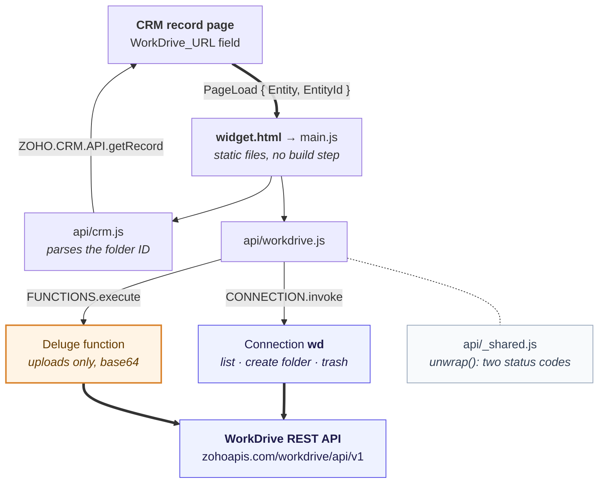
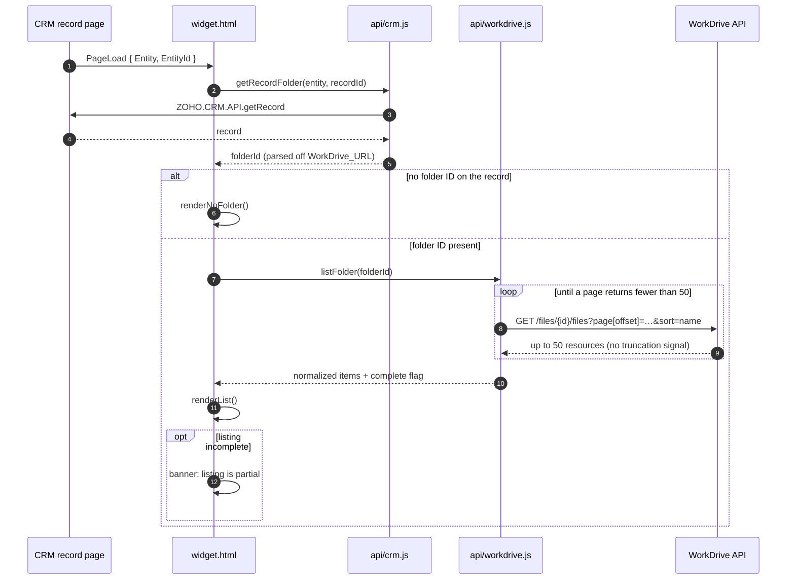

# Zoho CRM WorkDrive Widget

A Zoho CRM widget that lists a record's WorkDrive folder inline on the record page, and lets people create folders and upload files without leaving CRM.

Built for the **Jobs** module at Camco, but the code is module-agnostic: it works on any CRM module whose records carry a `WorkDrive_URL` field. See [Using it on other modules](#using-it-on-other-modules).

---

## Contents

- [What it does](#what-it-does)
  - [Delete means trash, deliberately](#delete-means-trash-deliberately)
- [How it works](#how-it-works)
  - [The load sequence](#the-load-sequence)
- [Prerequisites](#prerequisites)
- [Setup part 1: the CRM connection](#setup-part-1-the-crm-connection)
- [Setup part 2: the CRM field](#setup-part-2-the-crm-field)
- [Setup part 3: hosting the widget files](#setup-part-3-hosting-the-widget-files)
- [Setup part 4: registering the widget in CRM](#setup-part-4-registering-the-widget-in-crm)
- [Setup part 5: the upload function](#setup-part-5-the-upload-function-required)
- [Setup part 6: auto-creating folders on new records](#setup-part-6-auto-creating-folders-on-new-records-optional)
- [Using it on other modules](#using-it-on-other-modules)
- [Local development](#local-development)
- [Deploying](#deploying)
- [Known issues and limitations](#known-issues-and-limitations)
- [Troubleshooting](#troubleshooting)
- [Repo layout](#repo-layout)
- [Verified integration facts](#verified-integration-facts)

---

## What it does

Every job has a folder of documents somewhere in WorkDrive: photos, scopes of work, signed change orders. Getting to them normally means leaving the CRM record, finding the right folder in WorkDrive, and losing your place. This widget puts that folder on the record.

On a record page it shows:

- The contents of the record's WorkDrive folder, folders first, then files by name, each with an icon for its file type
- Breadcrumb navigation into subfolders and back out
- **New Folder**, which creates a subfolder in the folder you're viewing
- **Upload**, plus drag-and-drop anywhere on the panel
- **Delete**, via per-row checkboxes and a toolbar button that appears only when something is ticked
- **Open in WorkDrive**, which follows you into subfolders and stays available even when the listing fails

Clicking a file opens it in WorkDrive. The widget is a browser and an uploader, not a viewer or an editor.

### Delete means trash, deliberately

WorkDrive offers two kinds of removal, and the widget only ever uses the recoverable one:

| | Endpoint | Effect | Used here |
|---|---|---|---|
| Trash | `PATCH /files` with `attributes.status: "61"` | Moves to Trash, restorable | **Yes** |
| Delete | `DELETE /files/{id}` | Permanent | **Never** |

A CRM sidebar is the wrong place to offer irreversible destruction of a client's documents, and WorkDrive's own UI trashes by default. Don't "fix" this by switching to `DELETE`.

The confirmation dialog names the items being removed rather than just counting them, warns separately when a folder is included (folders go with everything inside them), and focuses Cancel rather than the destructive button. Two tests pin `TRASH_STATUS === "61"` and the PATCH payload shape, so a change that would cause permanent deletion fails the suite before it reaches production.

Trashing goes through `CONNECTION.invoke` rather than a Deluge function, because there is no WorkDrive Deluge task for deletion and the payload is a small JSON array of IDs, not a file. A successful trash returns `204` with no body, so `trashItems()` treats any 2xx as done rather than looking for a `data` key.

Because it's a `PATCH`, it's a write: the `wd` connection needs `WorkDrive.files.ALL`, and the account that authorized that connection needs delete rights on the folder itself. See [Delete needs write permission, in two places](#delete-needs-write-permission-in-two-places).

### What it deliberately does not do

Renaming, moving, sharing, and previewing are all absent. WorkDrive already does those well, and the "Open in WorkDrive" button is one click away.

---

## How it works



Reads, folder creation, and trashing go through the `wd` connection straight from the browser. **Uploads take a different path** through a Deluge function, because the connection layer cannot carry a file payload. That is the single most important thing to know when setting this up, and it is why [step 5](#setup-part-5-the-upload-function-required) is not optional.

### The load sequence



The steps in words:

1. CRM fires `PageLoad` with the module (`Entity`) and record ID (`EntityId`).
2. The widget reads that record and pulls `WorkDrive_URL` off it.
3. It parses the folder ID from the end of that URL. A bare ID in the field also works.
4. It lists the folder through the `wd` connection, paging until a page comes back short, and renders the result.

### Design notes worth knowing before you change anything

**The response envelope has two status codes.** `ZOHO.CRM.CONNECTION.invoke` wraps the upstream response, so `resp.code` tells you whether the *connection call* worked and `resp.details.statusCode` tells you what *WorkDrive* returned. A WorkDrive 403 arrives inside a perfectly successful connection call. Read only the outer status and a permission error looks like a success. `unwrap()` in [`app/js/api/_shared.js`](app/js/api/_shared.js) handles this and there are tests pinning it.

**Listings silently truncate at 50.** `GET /files/{id}/files` returns at most 50 items and gives no signal that it truncated: no meta block, no cursor, no total. A 52-file folder returns a bare array of 50 that is indistinguishable from a complete listing. `listFolder()` pages until a response comes back short, and passes `sort=name` so paging is stable. If a listing is ever incomplete the UI says so rather than presenting a partial folder as whole.

**Attribute names differ between endpoints.** The list endpoint returns `id` and `name`; the upload endpoint returns `attributes.resource_id` and `FileName`. `toItem()` normalizes all of it, with tests per shape.

---

## Prerequisites

- A Zoho CRM account with admin access to **Setup**
- A Zoho WorkDrive account on the same org, with a folder structure to point at
- Somewhere to host static files over **HTTPS** (any web host; no server-side runtime needed)
- Node.js 18+ if you want to run the local dev server or the tests

---

## Setup part 1: the CRM connection

The widget talks to WorkDrive through a named CRM connection. Without it every call fails.

1. Go to **Setup → Developer Hub → Connections**.
2. Click **Create Connection**, pick **Zoho OAuth**, and choose the **Zoho WorkDrive** service.
3. Name it exactly **`wd`**. The connection *Link Name* is what the code uses.
4. Add these scopes:

   | Scope | Needed for |
   |---|---|
   | `WorkDrive.files.ALL` | Listing folders, and **deleting** (moving items to Trash) |
   | `WorkDrive.files.CREATE` | Creating folders, uploading files |

5. Save, then click **Authorize** and complete the OAuth prompt.

Verify the connection shows as authorized before moving on. If you name it something other than `wd`, change `CONNECTION` in [`app/js/config.js`](app/js/config.js) and `connectionStr` in both Deluge functions to match.

### Delete needs write permission, in two places

Delete is the one operation where the scope alone isn't enough, and the two requirements fail in different ways.

**The connection needs `WorkDrive.files.ALL`.** Trashing is a `PATCH /files`, a write, so a connection carrying only read or only `CREATE` scope cannot do it. `WorkDrive.files.ALL` covers reads and writes, which is why it appears against both listing and deleting above.

**The connection's owner needs delete rights on the folder in WorkDrive.** Every call runs as whoever authorized the connection, not as the CRM user clicking the button. If that account has view-only or comment-only access to the team folder, trashing fails no matter how the scopes are set. This is the more common cause in practice, and the one no amount of re-authorizing will fix.

A failure from either shows up as **"You don't have permission to view this folder in WorkDrive"** on the delete action, because WorkDrive answers both with a 403. Check the owner's access to the folder first; it's the likelier of the two and the faster to confirm.

> An `authentication.status: true` on a connection only means a token exists. It does not prove the token works, and it says nothing about what the owning account may do inside WorkDrive. The first real API call is the actual test.

---

## Setup part 2: the CRM field

The module needs a field holding the WorkDrive folder address.

1. Go to **Setup → Customization → Modules and Fields**, open your module (**Jobs**), and edit the layout.
2. Add a **URL** field labelled **`WorkDrive URL`**.
3. **Check the API name.** CRM derives `WorkDrive_URL` from that label, but appends a suffix if the name is already taken. Open the field's properties and confirm the API name is exactly `WorkDrive_URL`.
4. Save the layout.

The field holds the full WorkDrive folder address:

```
https://workdrive.zoho.com/folder/hr0wc4f4a3afc626a4c148238db8e68e2545c
```

A URL field is used deliberately: it renders as a clickable link on the record, so people can reach WorkDrive even if the widget itself is having a bad day. The widget parses the folder ID off the end.

### Optional fallback field

The code also reads a plain-text field named `WorkDrive_Folder_ID` holding a bare folder ID, if `WorkDrive_URL` is empty. Either field alone is enough, and the fallback can be skipped entirely. Both API names are configurable at the top of [`app/js/config.js`](app/js/config.js).

---

## Setup part 3: hosting the widget files

Only the **`app/`** directory ships. Everything else in this repo is local tooling.

Upload the contents of `app/` to any HTTPS static host, preserving the directory structure:

```
https://your-domain.com/zoho-widgets/workdrive-widget/
    widget.html          ← the entry point; keep this filename
    index.html
    css/widget.css
    js/...
```

Requirements:

- **HTTPS is mandatory.** CRM will not load a widget over plain HTTP.
- The host must allow being framed by CRM. If it sends `X-Frame-Options: DENY` or a restrictive `frame-ancestors`, the widget renders blank with no error.
- No build step, no server-side runtime. The deployed files are exactly the source, which matters when the only way to debug is through a cross-origin iframe inside someone else's page.

There is an FTP deploy script wired up for this repo; see [Deploying](#deploying).

---

## Setup part 4: registering the widget in CRM

1. Go to **Setup → Developer Hub → Widgets** and click **Create New Widget**.
2. Fill in:

   | Field | Value |
   |---|---|
   | Name | `Job Files` |
   | Type | `Related List` |
   | Hosting | `External` |
   | Base URL | `https://your-domain.com/zoho-widgets/workdrive-widget/widget.html` |

3. Save.
4. Go to **Setup → Customization → Modules and Fields → Jobs → Layouts**, open the layout.
5. From the left panel drag **Related List** onto the layout where you want the panel.
6. Choose the `Job Files` widget, name the section (**Files** works), and save the layout.

Open a record that has `WorkDrive_URL` populated. The folder contents should appear.

---

## Setup part 5: the upload function (required)

**Uploads do not work without this.** Browsing, folder creation, and delete all work fine without it, which makes it easy to think setup is finished when it isn't. Two parts have to be right: the function itself, and the REST API toggles on it. Miss either and uploads are the only thing that fails.

The reason is in [Known issues](#uploads-cannot-go-through-the-connection-layer): `ZOHO.CRM.CONNECTION.invoke` marshals its payload as `application/x-www-form-urlencoded`, and a base64 file of any real size is rejected before it ever reaches WorkDrive. Uploads route through a Deluge function instead, where `zoho.workdrive.uploadFile` handles multipart properly server-side.

1. Go to **Setup → Automation → Functions** and click **New Function**.
2. Configure it:

   | Setting | Value |
   |---|---|
   | Function Name | `upload_file_to_workdrive` |
   | Display Name | `Upload File To WorkDrive` |
   | Category | **Standalone** |

3. Paste the contents of [`deluge/upload_file_to_workdrive.dg`](deluge/upload_file_to_workdrive.dg).
4. Add three arguments, **in this order**, all of type **String**:

   | # | Name | Carries |
   |---|---|---|
   | 1 | `folderIdStr` | target WorkDrive folder ID |
   | 2 | `fileNameStr` | file name as typed by the user |
   | 3 | `fileContentStr` | base64 of the file, no `data:` prefix |

   The names must match exactly. The widget calls the function with named arguments.

5. If your connection is not named `wd`, update `connectionStr` at the top of the function.
6. **Save**, then **Publish**. An unpublished function is not callable from a widget.
7. Open the function's **Overview** tab and find the **REST API** panel. **Turn on both `OAuth 2.0` and `API Key`.**

### The REST API toggles are required

This is the step that makes uploads work, and it is not obvious. Reading the docs you would expect it to be unnecessary: the widget calls the function through `ZOHO.CRM.FUNCTIONS.execute()` from inside an already-authenticated CRM session, and the function reaches WorkDrive through the `wd` connection rather than through any credential on the function itself. Nothing in that chain looks like it needs a REST endpoint.

It needs one anyway. **Verified 2026-09-09:** with both toggles off, uploads fail; turning on `OAuth 2.0` and `API Key` made them work, with no other change. `ZOHO.CRM.FUNCTIONS.execute()` evidently reaches the function over its REST endpoint, so the function has to expose one.

Enabling the toggles reveals two URLs on the panel. You do not need to copy either into the widget:

```
OAuth 2.0   https://www.zohoapis.com/crm/v7/functions/upload_file_to_workdrive/actions/execute?auth_type=oauth
API Key     https://www.zohoapis.com/crm/v7/functions/upload_file_to_workdrive/actions/execute?auth_type=apikey&zapikey=<key>
```

> **The API Key URL embeds a live `zapikey` that grants anyone who has it the ability to run this function.** Treat it as a credential: don't paste it into a ticket, a commit, or a screenshot. Regenerate it from this panel if it leaks.

Symptom when this is the problem: browsing, folder creation, and delete all work, and only uploads fail. Those three go through `CONNECTION.invoke`, which needs nothing on the function; uploads are the only path that touches it.

To confirm it works, open a record and upload a small file. On failure the widget shows the function's own error text rather than a generic message, and a function that isn't deployed produces a specific "isn't set up in CRM yet" message rather than a vague one.

---

## Setup part 6: auto-creating folders on new records (optional)

This is the workflow that gives every new record a WorkDrive folder automatically. Skip it if folders are created by hand or by another process; the widget works either way, as long as something eventually populates `WorkDrive_URL`.

The function checks whether `WorkDrive_URL` is already set, creates a folder named after the record under a fixed parent folder, and writes the new URL back to the record.

### Deploy the function

1. **Get the parent folder ID.** Open the WorkDrive folder that all record folders should live under. The ID is the last path segment of its URL:

   ```
   https://workdrive.zoho.com/folder/hr0wcd0b9ffb36e2e45b5bc0d4f0e93c3e3dd
                                     └──────────── this part ────────────┘
   ```

2. Go to **Setup → Automation → Functions → New Function**:

   | Setting | Value |
   |---|---|
   | Function Name | `create_workdrive_folder_on_new_job` |
   | Category | **Standalone** |

3. Paste the contents of [`deluge/create_workdrive_folder_on_new_job.dg`](deluge/create_workdrive_folder_on_new_job.dg).
4. Add one argument: `recId`, of type **Int**.
5. Edit the configuration block at the top of the function:

   ```javascript
   parentFolderIdStr = "...";   // the parent folder ID from step 1
   moduleStr         = "Jobs";  // the module this workflow runs on
   nameFieldStr      = "Name";  // primary field holding the record name
   ```

6. Change the `sendmail` recipient from `john@camco.tech` to whoever should get failure notices. There are four of these.
7. **Save** and **Publish**.

### Wire up the workflow

1. Go to **Setup → Automation → Workflow Rules** and click **Create Rule**.
2. Configure it:

   | Setting | Value |
   |---|---|
   | Module | `Jobs` |
   | Rule Name | `Create WorkDrive folder on new Job` |
   | Execute on | **Create** |
   | Condition | All records, or narrow it if only some records need folders |

3. Under **Instant Actions**, choose **Function**, pick `create_workdrive_folder_on_new_job`.
4. Map the argument: `recId` → the record's **Job Id** (the record ID merge field).
5. Save and make sure the rule is **active**.

### Verify

Create a test record. Within a few seconds `WorkDrive_URL` should be populated and the widget should show an empty folder. If nothing happens, the function's execution log (**Setup → Functions →** the function **→ Logs**) shows every `info` statement, and each exit path returns a prefixed string:

| Prefix | Meaning |
|---|---|
| `SUCCESS:` | folder created and the record updated |
| `SKIPPED:` | `WorkDrive_URL` was already set, nothing to do |
| `ERROR:` | something failed; the message says what |

The function is safe to re-run. It bails out when `WorkDrive_URL` is already populated, so a rule that fires twice will not create a second folder.

### The one failure that leaves a mess

If the folder is created but the record update then fails, you get an orphaned folder in WorkDrive that nothing points at. That path sends an email naming the folder ID so it can be cleaned up or reattached by hand. Every other failure path leaves nothing behind.

---

## Using it on other modules

The widget is module-agnostic. `PageLoad` tells it which module it is running on, so the same deployed files serve every module. **No code change is needed** to add a module.

What each module needs:

1. A field with the API name **`WorkDrive_URL`** (label it "WorkDrive URL"; verify the API name, since CRM appends a suffix on a collision).
2. The widget added to that module's layout as a Related List, following [step 4](#setup-part-4-registering-the-widget-in-crm). One registered widget can be placed on many modules.
3. That's it for browsing, folder creation, uploads, and delete. The `upload_file_to_workdrive` function is standalone and module-independent, so one copy serves every module.

### Record names on other modules

The root breadcrumb shows the record's name. Modules disagree about which field that is, so the widget tries a list in order: `Name`, `Job_Name`, `Deal_Name`, `Account_Name`, `Subject`, `Last_Name`. The first non-empty one wins.

If your module uses something else, add it to `NAME_FIELDS` in [`app/js/config.js`](app/js/config.js). This is cosmetic only. An unrecognized module still works; the breadcrumb just reads "Files".

### Auto-creation on other modules

The workflow function is the one piece that is not automatically portable, because **a workflow rule is bound to a single module**. To auto-create folders on a second module:

1. Duplicate `create_workdrive_folder_on_new_job` under a new name, e.g. `create_workdrive_folder_on_new_deal`.
2. Set `moduleStr` and `nameFieldStr` for that module, and point `parentFolderIdStr` at wherever that module's folders belong.
3. Create a workflow rule on that module pointing at the new copy.

### Worked example: adding Deals

| Step | Action |
|---|---|
| 1 | Add a URL field "WorkDrive URL" to Deals; confirm the API name is `WorkDrive_URL` |
| 2 | Drag the existing `Job Files` widget onto the Deals layout as a Related List |
| 3 | Paste a folder URL into a Deal and reload; browsing and uploads work immediately |
| 4 | *(optional)* Copy the create function, set `moduleStr = "Deals"` and `nameFieldStr = "Deal_Name"`, add a workflow rule on Deals |

The widget's section title is set per layout, so it can read "Job Files" on Jobs and "Deal Documents" on Deals without touching code.

---

## Local development

```bash
npm install
npm start          # or: zet run
```

Serves `https://127.0.0.1:5000` with `app/` mounted at **`/app`**, so the URL is:

```
https://127.0.0.1:5000/app/widget.html
```

Note the `/app` prefix. `https://127.0.0.1:5000/widget.html` will 404.

**First run:** the certificate is self-signed. Open `https://127.0.0.1:5000` in a browser tab and click through **Advanced → Proceed** *before* CRM tries to load it in an iframe. Skip this and the widget silently shows nothing, which looks exactly like a code bug and is not one.

To test against real CRM data, register a second dev-only widget in CRM Setup pointing at the localhost URL. The SDK and the `wd` connection only exist inside a CRM-hosted iframe, so there is no way around this. Opened directly in a tab, the widget detects the missing CRM context after six seconds and says so rather than hanging on a spinner.

### Tests

```bash
npm test
```

42 tests covering the pure logic: folder ID parsing, envelope unwrapping, pagination termination, attribute normalization across endpoint shapes, record-name resolution, HTML escaping, file-type icon mapping, and the trash payload. Anything needing a live CRM iframe is out of scope by design; parsing and formatting are kept pure so they stay testable outside a browser.

Two of those tests exist as a safety canary rather than to catch a likely bug: they pin `TRASH_STATUS` to `"61"` and the exact PATCH payload shape, so a change that would turn trashing into permanent deletion fails the suite instead of reaching a client's documents. Don't delete them.

### Debug logging

From the browser console inside the widget iframe:

```javascript
window.__WD_DEBUG = true;
```

Every raw `invoke()` request and response is then logged. Failures are logged regardless of this flag, since the message alone rarely explains an envelope problem.

---

## Deploying

```bash
npm run deploy:dry     # list what would upload, change nothing
npm run deploy         # upload app/ to the configured host
```

Credentials live in a gitignored `.env`; copy `.env.example` and fill it in. **Only `app/` is uploaded.** Everything else is local tooling and must never ship.

Run `deploy:dry` first. It is the cheapest way to catch a wrong remote path before overwriting something.

---

## Known issues and limitations

### Uploads cannot go through the connection layer

`ZOHO.CRM.CONNECTION.invoke` marshals its payload as `application/x-www-form-urlencoded`. A base64 file of any real size (~1.6 MB observed) is rejected before it ever reaches WorkDrive, and the rejection carries no usable detail client-side: it surfaces as a generic failure indistinguishable from an auth problem.

No amount of client-side work fixes this. `FormData` and hand-built multipart hit the same wall, because the payload never gets far enough for the encoding to matter. This is why uploads route through a Deluge function.

### Upload size ceiling is 10 MB, and it is a guess

`MAX_UPLOAD_BYTES` is set to 10 MB. That number is deliberately conservative, not measured. The file is base64'd in the browser, which inflates it about 33%, then passed as a CRM Function argument.

There is one documented hard limit in the chain: `zoho.encryption.base64DecodeToFile` accepts at most **25 MB of encoded text** outside Creator, which works out to roughly 18 MB of actual file. What is *not* documented is the maximum argument size CRM accepts for a function invoked from a widget, and that may well be the lower of the two.

Files over the limit are rejected client-side with a message pointing the user to WorkDrive. Raise the value only after testing where it actually breaks, and record the finding in [`docs/api-findings.md`](docs/api-findings.md).

### Listings truncate silently at 50 items per page

WorkDrive returns at most 50 items per page with no truncation signal at all. Handled by paging until a response comes back short, but two consequences remain:

- A very large folder costs one request per 50 items, so it is slower to render.
- There is a safety ceiling of 1000 items. Past that the widget stops and flags the listing as truncated rather than looping. Folders that large are better browsed in WorkDrive.

### `R008 Unauthorized access` usually means a bad parent folder ID

A create against a non-existent or unresolvable `parent_id` returns `401` with `{"errors":[{"id":"R008","title":"Unauthorized access"}]}`. The message points at authentication; the actual cause is usually a wrong or placeholder folder ID. WorkDrive cannot distinguish "this folder does not exist" from "you may not write here" and reports both identically.

Check the parent folder ID first. A round-trip around 20 ms means it was rejected before any real work happened, which is another sign it is the ID and not the permissions.

### Missing JSON:API header returns 415

Every WorkDrive endpoint rejects requests without `Accept: application/vnd.api+json`, with an unexplained HTTP 415. Use `JSONAPI_HEADERS` from `config.js`. If a call suddenly starts returning 415, check the headers before anything else.

### Other limitations

| Limitation | Detail |
|---|---|
| No rename, move, or share | Deliberate. Use WorkDrive for those. |
| Delete trashes, it does not remove | Items go to WorkDrive's Trash and are restorable from there. The widget cannot permanently delete, and cannot restore. |
| No file preview | Clicking a file opens it in WorkDrive in a new tab. |
| Duplicate names are rejected, not versioned | Uploads pass `override-name-exist: false`, so a name clash surfaces instead of silently replacing a document. |
| Uploads are sequential | One failure does not take down the batch, but a large batch is slow. The connection layer is not a high-throughput path. |
| Folder names strip `\ / : * ? " < > \|` | WorkDrive rejects these outright; both the widget and the Deluge function replace them with `-` first. |
| No refresh button | The panel reloads after a create or upload. Otherwise reload the record. |
| Requires the CRM iframe | The SDK and the `wd` connection only exist inside a CRM-hosted page. |
| One connection for everyone | All calls run through `wd`, so WorkDrive-side permissions are those of the connection's owner, not the CRM user. Anyone who can see the record can see the folder. |

That last one matters if different CRM users are meant to see different documents. This widget does not enforce per-user WorkDrive permissions, and with delete available, anyone who can open the record can trash that record's files. Items are recoverable from WorkDrive's Trash, but the widget offers no way to restore them.

---

## Troubleshooting

| Symptom | Likely cause |
|---|---|
| Panel is completely blank | Host is not HTTPS, is sending `X-Frame-Options`, or (locally) the self-signed cert hasn't been accepted yet |
| "No CRM context" after ~6 seconds | The page was opened directly instead of inside a CRM record |
| "No WorkDrive folder linked" | `WorkDrive_URL` is empty on that record |
| "That folder ID doesn't look right" | The field holds something that isn't a WorkDrive URL or a bare ID |
| "Folder not found" | The folder was deleted or moved, or the ID is wrong |
| "No access to this folder" | The `wd` connection's owner cannot reach that folder in WorkDrive |
| Everything works except delete | Either the connection is missing `WorkDrive.files.ALL` (trashing is a write), or its owner has view-only access to the folder. See [step 1](#delete-needs-write-permission-in-two-places) |
| Browsing works, uploads fail | Most often the function's **REST API** toggles (`OAuth 2.0` and `API Key`) are off; see [step 5](#the-rest-api-toggles-are-required). Otherwise the function isn't deployed, isn't published, or its argument names don't match |
| Upload function won't save in CRM | A `base64Decode` call that isn't `zoho.encryption.base64DecodeToFile`; see the note under [Verified integration facts](#verified-integration-facts) |
| Upload function saves but throws "No. of arguments mismatch" | `base64DecodeToFile` was called with one argument; it needs the file name as a second |
| Deleted file is gone from the widget but still in WorkDrive | Working as designed. Delete moves items to Trash, where they stay until emptied |
| Upload says "too large" | Over `MAX_UPLOAD_BYTES` (10 MB) |
| WorkDrive call fails with no detail | Set `window.__WD_DEBUG = true` in the console and retry; the raw envelope is logged |
| Folder shows fewer files than WorkDrive does | Check for the truncation banner; anything past the 1000-item ceiling is flagged |

When a response shape is genuinely unrecognized, the widget renders the raw envelope in a collapsible panel in the error state, so it can be diagnosed from inside the iframe without a rebuild.

---

## Repo layout

```
app/                    SHIPS. Static, hosting-agnostic, no build step.
  widget.html           entry point (keep this name)
  index.html            redirect to widget.html so the bare folder URL works
  css/widget.css
  js/
    main.js             SDK boot, PageLoad, orchestration
    config.js           every tunable value
    api/_shared.js      envelope unwrapping — read this before touching the API
    api/crm.js          record → folder ID
    api/workdrive.js    list / create folder / upload / trash
    ui/render.js        all DOM writes, including the confirm dialog
    ui/dropzone.js      drag-and-drop + file picker
deluge/                 CRM Functions, pasted into Setup by hand
  create_workdrive_folder_on_new_job.dg
  upload_file_to_workdrive.dg
tests/logic.test.mjs    pure-logic tests (node --test)
server/                 LOCAL ONLY — zet dev server
docs/api-findings.md    real request/response captures
mistakes.md             traps hit, and the rule that followed
```

**The boundary that matters:** only `app/` is uploaded. Everything else is local tooling or documentation.

---

## Verified integration facts

Confirmed against a live CRM tenant on 2026-09-09. These are expensive to rediscover.

| | |
|---|---|
| Module | `Jobs` (custom module, layout `Standard__s`) |
| Field | `WorkDrive_URL` (URL type, 450 chars) |
| Fallback field | `WorkDrive_Folder_ID` (text, 100 chars) |
| Connection | `wd` (service `zoho_workdrive`), authorized |
| Scopes | `WorkDrive.files.ALL` (read + write, and what delete needs) + `WorkDrive.files.CREATE` |
| Delete | Also requires the connection owner to hold delete rights on the folder in WorkDrive; the scope alone is not enough |
| JS SDK | `https://live.zwidgets.com/js-sdk/1.2/ZohoEmbededAppSDK.min.js` |

### WorkDrive endpoints (base `https://www.zohoapis.com/workdrive/api/v1`)

| Operation | Method | Path | `param_type` |
|---|---|---|---|
| List folder | GET | `/files/{id}/files` | 1 |
| Folder metadata | GET | `/files/{id}` | 1 |
| Create folder | POST | `/files` | 2 |
| Trash items | PATCH | `/files` | 2 |
| Upload file | POST | `/upload` | 2 |

Every endpoint needs `Accept: application/vnd.api+json`, or returns HTTP 415 every time.

Create-folder body:

```json
{"data":{"attributes":{"name":"...","parent_id":"<id>"},"type":"files"}}
```

Trash body, one entry per item. Status `61` is the recoverable trash state:

```json
{"data":[{"attributes":{"status":"61"},"id":"<id>","type":"files"}]}
```

Deluge built-in tasks used server-side. Both handle the JSON:API envelope and headers themselves, so none of the 415 workarounds apply:

```javascript
zoho.workdrive.createFolder(folderName, parentId, connection)
zoho.workdrive.uploadFile(file, folderId, encodedName, overwrite, connection)
zoho.encryption.base64DecodeToFile(encodedText, fileName)
```

`base64DecodeToFile` has three failure modes worth knowing, because two of them stop the function from saving at all:

| Call | Result |
|---|---|
| `base64Decode(str)` | No such global; the function is namespaced |
| `str.base64Decode()` | Not a string method either |
| `base64DecodeToFile(str)` | Saves, then fails at runtime: "No. of arguments mismatch" |

Both arguments are mandatory. Pass the **raw** file name here; the URL-encoded name goes to `uploadFile` separately. There is also a 25 MB ceiling on the encoded text outside Creator, which the widget's 10 MB limit stays well under.

Fuller captures, including response shapes per endpoint and the pagination evidence, are in [`docs/api-findings.md`](docs/api-findings.md).
